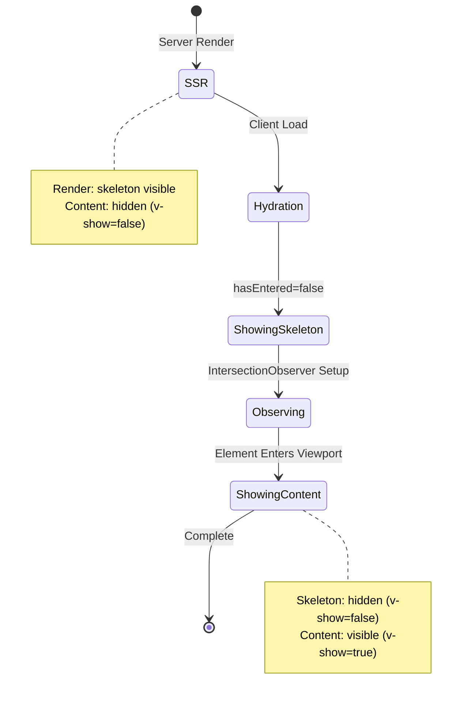
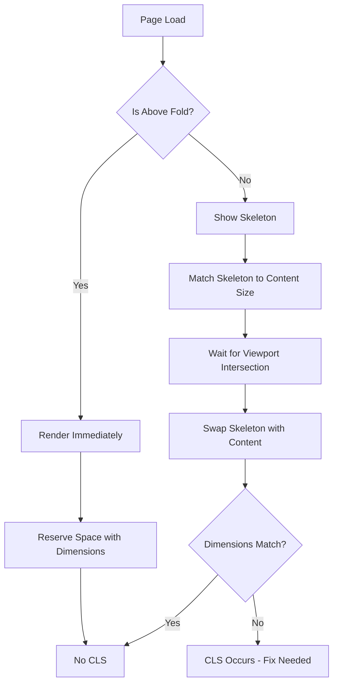

# Design Document

## Overview

This design addresses critical hydration mismatches and CLS issues in the portfolio application. The root causes are:

1. **ViewportLoader SSR Mismatch**: Component renders comment nodes during SSR but div elements on client
2. **Missing Image Dimensions**: Company logo in Hero lacks width/height attributes during SSR
3. **Skeleton-to-Content Transitions**: Layout shifts occur when skeletons are replaced with actual content
4. **Unused Preload Resources**: Profile images are preloaded but not used within the required timeframe

The solution involves fixing SSR rendering logic, ensuring consistent image dimensions, and optimizing resource loading.

## Architecture

### Component Hierarchy

```
App
├── Hero (above-the-fold, no lazy loading)
│   ├── Profile Avatar (NuxtImg with preload)
│   └── Company Logo (img with explicit dimensions)
└── ViewportLoader (lazy loading wrapper)
    ├── Skeleton Component (SSR + Client)
    └── Actual Content (Client only after intersection)
```

### SSR vs Client Rendering Strategy

**Current Problem:**
- ViewportLoader renders differently on server vs client
- Server: `<!-- comment -->` (from v-if conditions)
- Client: `<div>` wrapper with skeleton or content

**Solution:**
- Always render wrapper `<div>` during SSR
- Show skeleton during SSR, hide actual content
- On client hydration, maintain same structure
- Transition from skeleton to content only after intersection

## Components and Interfaces

### 1. ViewportLoader Component Redesign

**Current Implementation Issues:**
```vue
<template>
  <div ref="elementRef">
    <component :is="skeleton" v-if="!hasEntered && skeleton" />
    <slot v-if="isVisible || hasEntered" />
  </div>
</template>
```

Problems:
- `v-if` conditions create different DOM during SSR vs client
- `hasEntered` is false during SSR, true after intersection
- Causes "rendered on server: comment, expected on client: div"

**New Implementation:**

```vue
<template>
  <div ref="elementRef" class="viewport-loader">
    <!-- Always render skeleton during SSR, hide after content loads -->
    <div v-show="!hasEntered && skeleton" class="skeleton-wrapper">
      <component :is="skeleton" />
    </div>
    
    <!-- Always render slot wrapper, show after intersection -->
    <div v-show="hasEntered" class="content-wrapper">
      <slot />
    </div>
  </div>
</template>
```

Key Changes:
- Replace `v-if` with `v-show` to maintain consistent DOM
- Always render both skeleton and content wrappers
- Use CSS `display: none` for visibility control
- Prevents hydration mismatch by keeping DOM structure identical

**Props Interface:**
```typescript
interface ViewportLoaderProps {
  threshold?: number        // Intersection threshold (default: 0.1)
  rootMargin?: string      // Early loading margin (default: '50px')
  skeleton?: Component     // Skeleton component to show during loading
  eager?: boolean          // Skip lazy loading, show content immediately
}
```

### 2. Hero Component Image Fixes

**Current Issue:**
```vue

```

Problem: `v-if` causes attribute mismatch during hydration

**Solution:**
```vue

```

Changes:
- Change `loading="lazy"` to `loading="eager"` (above-the-fold image)
- Add `decoding="async"` for non-blocking rendering
- Ensure width/height are always present (already correct)

**Profile Avatar Fix:**
```vue
<NuxtImg 
  :src="portfolio.profile.avatar || undefined" 
  :alt="portfolio.profile.name"
  sizes="96px sm:128px md:160px" 
  width="160" 
  height="160" 
  class="h-full w-full object-cover" 
  format="webp"
  preload
  loading="eager"
  fetchpriority="high" />
```

Changes:
- Add `loading="eager"` (above-the-fold)
- Add `fetchpriority="high"` for LCP optimization
- Keep `preload` but ensure it's used immediately

### 3. Skeleton Dimension Matching

**Problem:** Skeletons don't match actual content dimensions, causing CLS

**Solution Strategy:**

1. **Measure Actual Content Heights:**
   - Skills section: ~400px
   - Work Experience: ~800px
   - Education: ~300px
   - Recommendations: ~500px

2. **Apply Min-Height to Skeletons:**
```vue
<template>
  <section class="py-6 min-h-[400px]">
    <!-- Skeleton content -->
  </section>
</template>
```

3. **Match Padding and Margins:**
   - Ensure skeleton has identical spacing as actual content
   - Use same container classes (UContainer, py-6, etc.)

4. **Explicit Dimensions on Skeleton Elements:**
```css
.skeleton-element {
  width: 100%;
  height: 2rem;
  min-height: 2rem; /* Prevent collapse */
  min-width: 2rem;
}
```

### 4. useLazyLoad Composable Enhancement

**Current Implementation:**
- Returns `isVisible`, `hasEntered`, `elementRef`
- Works only on client (onMounted)

**Enhancement Needed:**
```typescript
export function useLazyLoad(config: LazyLoadConfig = {}) {
  const isVisible = ref(false)
  const hasEntered = ref(false)
  const elementRef = ref<HTMLElement | null>(null)
  
  // SSR: hasEntered should be false
  // Client: starts false, becomes true after intersection
  
  onMounted(() => {
    if (!window.IntersectionObserver) {
      // Fallback: show immediately
      isVisible.value = true
      hasEntered.value = true
      return
    }
    
    const observer = new IntersectionObserver(
      (entries) => {
        entries.forEach((entry) => {
          if (entry.isIntersecting) {
            isVisible.value = true
            hasEntered.value = true
            if (config.once) {
              observer.disconnect()
            }
          }
        })
      },
      {
        threshold: config.threshold ?? 0.1,
        rootMargin: config.rootMargin ?? '50px'
      }
    )
    
    if (elementRef.value) {
      observer.observe(elementRef.value)
    }
  })
  
  return { isVisible, elementRef, hasEntered }
}
```

No changes needed - current implementation is correct.

## Data Models

### Hydration State

```typescript
interface HydrationState {
  hasEntered: boolean      // Whether component has entered viewport
  isVisible: boolean       // Current visibility state
  isSSR: boolean          // Whether currently in SSR context
}
```

### Image Preload Configuration

```typescript
interface ImagePreloadConfig {
  src: string
  as: 'image'
  type: string            // e.g., 'image/webp'
  fetchpriority: 'high' | 'low' | 'auto'
  imagesrcset?: string    // For responsive images
}
```

## Error Handling

### Hydration Mismatch Detection

1. **Development Mode:**
   - Vue automatically logs hydration mismatches
   - Add custom error boundary to catch and report

2. **Production Mode:**
   - Hydration mismatches are silent
   - Implement custom detection:

```typescript
// In app.vue or plugin
if (import.meta.client) {
  const originalError = console.error
  console.error = (...args) => {
    if (args[0]?.includes?.('Hydration')) {
      // Log to monitoring service
      reportHydrationError(args)
    }
    originalError.apply(console, args)
  }
}
```

### CLS Monitoring

```typescript
// In performance monitoring plugin
if ('LayoutShift' in window) {
  const observer = new PerformanceObserver((list) => {
    for (const entry of list.getEntries()) {
      if (entry.hadRecentInput) continue
      
      const cls = entry as LayoutShift
      if (cls.value > 0.1) {
        console.warn('[CLS] Layout shift detected:', {
          value: cls.value,
          sources: cls.sources
        })
      }
    }
  })
  
  observer.observe({ type: 'layout-shift', buffered: true })
}
```

## Testing Strategy

### 1. Hydration Testing

**Manual Testing:**
1. Run `npm run build && npm run preview`
2. Open DevTools Console
3. Look for hydration warnings
4. Verify zero mismatches

**Automated Testing:**
```typescript
// tests/hydration.spec.ts
import { test, expect } from '@playwright/test'

test('should have no hydration mismatches', async ({ page }) => {
  const errors: string[] = []
  
  page.on('console', (msg) => {
    if (msg.type() === 'error' || msg.type() === 'warning') {
      const text = msg.text()
      if (text.includes('Hydration')) {
        errors.push(text)
      }
    }
  })
  
  await page.goto('http://localhost:3000')
  await page.waitForLoadState('networkidle')
  
  expect(errors).toHaveLength(0)
})
```

### 2. CLS Testing

**Manual Testing:**
1. Open Chrome DevTools
2. Go to Performance tab
3. Record page load
4. Check Experience section for CLS
5. Verify CLS < 0.1

**Automated Testing:**
```typescript
// tests/cls.spec.ts
test('should have CLS below 0.1', async ({ page }) => {
  await page.goto('http://localhost:3000')
  
  const cls = await page.evaluate(() => {
    return new Promise<number>((resolve) => {
      let clsValue = 0
      const observer = new PerformanceObserver((list) => {
        for (const entry of list.getEntries()) {
          if (!(entry as any).hadRecentInput) {
            clsValue += (entry as any).value
          }
        }
      })
      observer.observe({ type: 'layout-shift', buffered: true })
      
      setTimeout(() => {
        observer.disconnect()
        resolve(clsValue)
      }, 5000)
    })
  })
  
  expect(cls).toBeLessThan(0.1)
})
```

### 3. Visual Regression Testing

**Skeleton Matching:**
1. Take screenshot of skeleton state
2. Take screenshot of loaded state
3. Compare dimensions and layout
4. Ensure no shifts between states

```typescript
test('skeleton should match content dimensions', async ({ page }) => {
  await page.goto('http://localhost:3000')
  
  // Capture skeleton state
  const skeleton = await page.locator('.skeleton-wrapper').first()
  const skeletonBox = await skeleton.boundingBox()
  
  // Wait for content to load
  await page.waitForSelector('.content-wrapper', { state: 'visible' })
  
  // Capture content state
  const content = await page.locator('.content-wrapper').first()
  const contentBox = await content.boundingBox()
  
  // Heights should be within 5% tolerance
  const heightDiff = Math.abs(skeletonBox!.height - contentBox!.height)
  const tolerance = contentBox!.height * 0.05
  
  expect(heightDiff).toBeLessThan(tolerance)
})
```

### 4. Preload Resource Testing

```typescript
test('preloaded images should be used', async ({ page }) => {
  const unusedPreloads: string[] = []
  
  page.on('console', (msg) => {
    const text = msg.text()
    if (text.includes('preloaded using link preload but not used')) {
      unusedPreloads.push(text)
    }
  })
  
  await page.goto('http://localhost:3000')
  await page.waitForLoadState('networkidle')
  await page.waitForTimeout(5000) // Wait for preload warning
  
  expect(unusedPreloads).toHaveLength(0)
})
```

## Implementation Phases

### Phase 1: Fix ViewportLoader Hydration
- Replace `v-if` with `v-show`
- Test hydration in production build
- Verify no console errors

### Phase 2: Fix Hero Component Images
- Update company logo loading strategy
- Fix profile avatar preload
- Test image loading performance

### Phase 3: Match Skeleton Dimensions
- Measure actual content heights
- Update all skeleton components
- Add min-height constraints

### Phase 4: Optimize Preloading
- Remove unused preloads
- Configure proper preload attributes
- Test resource loading timing

### Phase 5: Add Monitoring
- Implement CLS tracking
- Add hydration error detection
- Set up automated tests

## Performance Targets

| Metric | Current | Target | Strategy |
|--------|---------|--------|----------|
| CLS | 0.546 | < 0.1 | Fix skeleton dimensions, prevent layout shifts |
| Hydration Errors | 15+ | 0 | Fix ViewportLoader, ensure consistent SSR/client rendering |
| Unused Preloads | 2 | 0 | Remove or fix preload configuration |
| LCP | Unknown | < 2.5s | Optimize hero image loading with fetchpriority |

## Diagrams

### ViewportLoader State Machine



### CLS Prevention Strategy



## Security Considerations

- No security implications for this change
- All changes are client-side rendering optimizations
- No new external dependencies introduced

## Accessibility Considerations

- Skeleton loaders should have `aria-busy="true"` and `aria-live="polite"`
- Content should announce when loaded for screen readers
- Ensure focus management during skeleton-to-content transitions

```vue
<div 
  v-show="!hasEntered && skeleton" 
  class="skeleton-wrapper"
  aria-busy="true"
  aria-live="polite"
  aria-label="Loading content">
  <component :is="skeleton" />
</div>

<div 
  v-show="hasEntered" 
  class="content-wrapper"
  aria-live="polite">
  <slot />
</div>
```
