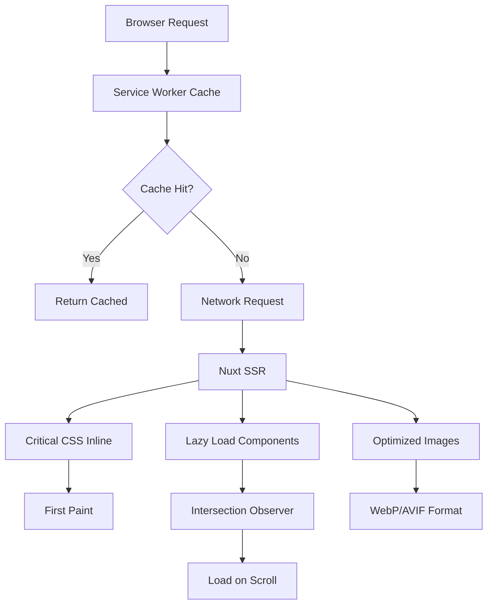

# Design Document

## Overview

این سند طراحی راه‌حل‌های بهینه‌سازی performance برای وب‌سایت پورتفولیو را شرح می‌دهد. بر اساس تحلیل Lighthouse و Chrome DevTools، سه حوزه اصلی برای بهبود شناسایی شده:

1. **DOM Size Optimization**: کاهش تعداد عناصر DOM و بهینه‌سازی rendering
2. **Caching Strategy**: پیاده‌سازی cache headers مناسب و service worker
3. **Asset Optimization**: بهینه‌سازی تصاویر، فونت‌ها و lazy loading

### Current Performance Metrics

بر اساس تحلیل انجام شده:
- **DOM Size**: 1139 عنصر (بیش از حد توصیه شده 800)
- **Style Recalculation**: 197ms (بیش از حد مطلوب 100ms)
- **Layout Update**: 49ms با 1139 node (هدف: کمتر از 500 node)
- **CLS**: 0.00 (عالی - باید حفظ شود و زیر 0.1 باقی بماند)
- **Third-Party Impact**: bitterbrains.com با 74B و 0.5ms (هدف: زمان اجرا کمتر از 50ms)
- **Cache Issues**: TTL = 0 برای third-party scripts (هدف: TTL حداقل 31536000 ثانیه برای static assets)

## Architecture

### Component Structure

```
app/
├── pages/
│   └── index.vue (Main page - needs optimization)
├── components/
│   └── portfolio/
│       ├── Hero.vue (Above-the-fold - critical)
│       ├── Skills.vue (Below-the-fold - lazy load candidate)
│       ├── AIStack.vue (Below-the-fold - lazy load candidate)
│       ├── WorkExperience.vue (Below-the-fold - lazy load candidate)
│       ├── RecommendationsCarousel.vue (Heavy component - needs optimization)
│       └── ProjectsList.vue (Below-the-fold - lazy load candidate)
└── composables/
    └── usePortfolio.ts (Data management)
```

### Optimization Layers



## Components and Interfaces

### 1. Lazy Loading System

#### Interface: `LazyComponent`

```typescript
interface LazyComponentConfig {
  component: Component
  threshold?: number // Intersection observer threshold (default: 0.1)
  rootMargin?: string // Root margin for early loading (default: '50px')
  placeholder?: Component // Skeleton/placeholder component
}

interface LazyLoadComposable {
  isVisible: Ref<boolean>
  elementRef: Ref<HTMLElement | null>
  hasEntered: Ref<boolean>
}
```

#### Implementation Strategy

**Current State:**
```vue
<!-- index.vue - همه کامپوننت‌ها به صورت async import شده‌اند -->
<template>
  <Hero />
  <Skills />
  <AIStack />
  <WorkExperience />
  <RecommendationsCarousel />
  <ProjectsList />
</template>

<script setup>
const Skills = defineAsyncComponent(() => import('@/components/portfolio/Skills.vue'))
// ... other async components
</script>
```

**Optimized Approach:**
```vue
<template>
  <Hero />
  <LazyHydrate when-visible>
    <Skills />
  </LazyHydrate>
  <LazyHydrate when-visible>
    <AIStack />
  </LazyHydrate>
  <!-- ... -->
</template>
```

### 2. Image Optimization

#### Current Implementation Analysis

```vue
<!-- Hero.vue - Profile image -->
<NuxtImg 
  :src="portfolio.profile.avatar" 
  sizes="96px sm:128px md:160px" 
  width="160" 
  height="160" 
  format="webp"
  preload  <!-- Critical image - good! -->
/>

<!-- RecommendationsCarousel.vue - Social icons as data URIs -->
<!-- ✓ Good: Inline SVG data URIs reduce HTTP requests -->
```

**Optimization Strategy:**

1. **Critical Images** (Hero avatar): Keep `preload`, ensure WebP/AVIF
2. **Below-fold Images**: Add `loading="lazy"`
3. **Decorative Icons**: Continue using inline SVG data URIs
4. **Project Thumbnails**: Implement responsive images with srcset

#### Enhanced Image Component

```typescript
interface OptimizedImageProps {
  src: string
  alt: string
  width: number
  height: number
  priority?: boolean // For LCP images
  sizes?: string
  quality?: number // Default: 80
  format?: 'webp' | 'avif' | 'auto'
}
```

### 3. DOM Size Reduction

#### Problem Areas

1. **RecommendationsCarousel**: Renders all recommendation cards
2. **Skills Section**: Renders all skill items at once
3. **WorkExperience**: Multiple nested elements

#### Solution: Virtual Scrolling & Conditional Rendering

```typescript
interface VirtualListConfig {
  items: any[]
  itemHeight: number
  overscan?: number // Number of items to render outside viewport
  containerHeight: number
}

// For carousel: Only render visible slides + 1 on each side
interface CarouselOptimization {
  visibleSlides: number
  preloadAdjacent: number // Default: 1
  unloadDistance: number // Unload slides N positions away
}
```

**RecommendationsCarousel Optimization:**

```vue
<!-- Current: Renders all items -->
<UCarousel :items="recs" />

<!-- Optimized: Virtual rendering -->
<UCarousel 
  :items="recs" 
  :render-visible-only="true"
  :preload-adjacent="1"
/>
```

### 4. Style Optimization

#### Current Issues

- Style recalculation: 197ms (920 elements affected)
- Multiple recalculations during initial render

#### Solutions

**A. CSS Containment**

```css
/* Add to main.css */
.portfolio-section {
  contain: layout style paint;
}

.skill-card {
  contain: layout paint;
}

.recommendation-card {
  contain: layout style paint;
}
```

**B. Critical CSS Extraction**

```typescript
// nuxt.config.ts enhancement
export default defineNuxtConfig({
  experimental: {
    inlineSSRStyles: false // Prevent inline styles bloat
  },
  nitro: {
    compressPublicAssets: true
  }
})
```

**C. Reduce CSS Complexity**

- Simplify selectors in Tailwind classes
- Use CSS custom properties for theme values
- Avoid deep nesting in component styles

### 5. Caching Strategy

#### Service Worker Implementation

```typescript
// sw.js - Service Worker for caching
interface CacheStrategy {
  name: string
  pattern: RegExp
  strategy: 'CacheFirst' | 'NetworkFirst' | 'StaleWhileRevalidate'
  maxAge?: number
  maxEntries?: number
}

const cacheStrategies: CacheStrategy[] = [
  {
    name: 'static-assets',
    pattern: /\.(js|css|woff2|png|jpg|webp|svg)$/,
    strategy: 'CacheFirst',
    maxAge: 31536000, // 1 year
    maxEntries: 100
  },
  {
    name: 'api-data',
    pattern: /\/api\//,
    strategy: 'NetworkFirst',
    maxAge: 300, // 5 minutes
    maxEntries: 50
  },
  {
    name: 'images',
    pattern: /\/_vercel\/image/,
    strategy: 'CacheFirst',
    maxAge: 2592000, // 30 days
    maxEntries: 60
  }
]
```

#### HTTP Cache Headers

**Design Decision:** استفاده از TTL 31536000 ثانیه (1 سال) برای static assets مطابق با Requirement 2.1 و استفاده از `immutable` directive برای تصاویر مطابق با Requirement 2.4.

```typescript
// server/middleware/cache-headers.ts
export default defineEventHandler((event) => {
  const url = event.node.req.url || ''
  
  // Static assets: 1 year cache (31536000 seconds) - Requirement 2.1
  if (/\.(js|css|woff2|png|jpg|webp|svg)$/.test(url)) {
    setHeader(event, 'Cache-Control', 'public, max-age=31536000, immutable')
  }
  
  // HTML: No cache (for dynamic content)
  if (url.endsWith('.html') || url === '/') {
    setHeader(event, 'Cache-Control', 'public, max-age=0, must-revalidate')
  }
  
  // Images from Vercel Image Optimization - Requirement 2.4 (immutable)
  if (url.includes('/_vercel/image')) {
    setHeader(event, 'Cache-Control', 'public, max-age=31536000, immutable')
  }
})
```

### 6. Font Optimization

#### Current Configuration

```typescript
// nuxt.config.ts
fonts: {
  families: [
    { name: 'Fraunces', provider: 'google', weights: [600, 700] },
    { name: 'Inter', provider: 'google', weights: [400, 500, 600, 700] },
    { name: 'Outfit', provider: 'google', weights: [300, 400, 500, 600, 700] }
  ]
}
```

#### Optimization Strategy

```typescript
// Enhanced font configuration
fonts: {
  defaults: {
    preload: true,
    display: 'swap', // Prevent FOIT
    fallback: true
  },
  families: [
    { 
      name: 'Inter', 
      provider: 'google', 
      weights: [400, 600], // Reduce weights
      subsets: ['latin'],
      display: 'swap'
    }
  ]
}
```

**Font Loading Strategy:**

```css
/* Add to main.css */
@font-face {
  font-family: 'Inter';
  font-display: swap;
  font-weight: 400 600;
  src: url('/fonts/inter-var.woff2') format('woff2-variations');
}

/* Fallback font matching */
body {
  font-family: 'Inter', -apple-system, BlinkMacSystemFont, 'Segoe UI', sans-serif;
}
```

### 7. Third-Party Script Management

#### Current Issue

- bitterbrains.com script: 74B, 0.5ms (minimal impact but no cache)

#### Design Decision

مطابق با Requirements 3.1, 3.2, 3.3, و 3.4، باید اسکریپت‌های third-party را بهینه کنیم:
- استفاده از async/defer loading (Req 3.1)
- حذف اسکریپت‌های غیرضروری (Req 3.2)
- محدود کردن زمان اجرا به کمتر از 50ms (Req 3.3)
- کاهش تعداد third-party domains (Req 3.4)

#### Solution

**Option 1: Optimize Loading (Requirement 3.1)**

```vue
<!-- app.vue or nuxt.config.ts -->
<script setup>
useHead({
  script: [
    {
      src: 'https://media.bitterbrains.com/js?affiliate=UILIB&type=top',
      async: true,
      defer: true,
      // Load after page interactive to ensure <50ms main thread time
      tagPosition: 'bodyClose',
      // Monitor execution time
      onload: () => {
        if (import.meta.client) {
          const perfEntries = performance.getEntriesByName(
            'https://media.bitterbrains.com/js?affiliate=UILIB&type=top'
          )
          if (perfEntries.length > 0) {
            const executionTime = perfEntries[0].duration
            if (executionTime > 50) {
              console.warn('Third-party script exceeded 50ms threshold:', executionTime)
            }
          }
        }
      }
    }
  ]
})
</script>
```

**Option 2: Remove if not essential (Requirement 3.2)**

```typescript
// If analytics/tracking is not critical, consider removing
// to minimize third-party domains (Requirement 3.4)
if (process.env.NODE_ENV === 'production' && isEssential) {
  // Load third-party scripts
}
```

**Recommendation:** ارزیابی کنید که آیا این اسکریپت ضروری است. اگر نه، حذف کنید تا Requirements 3.2 و 3.4 را برآورده کنید.

## Data Models

### Performance Metrics Tracking

```typescript
interface PerformanceMetrics {
  // Core Web Vitals
  lcp: number // Largest Contentful Paint
  fid: number // First Input Delay
  cls: number // Cumulative Layout Shift
  
  // Additional metrics
  ttfb: number // Time to First Byte
  fcp: number // First Contentful Paint
  tti: number // Time to Interactive
  
  // Custom metrics
  domSize: number
  styleRecalcTime: number
  layoutTime: number
  
  timestamp: Date
}

interface OptimizationResult {
  metric: keyof PerformanceMetrics
  before: number
  after: number
  improvement: number // Percentage
  target: number
  achieved: boolean
}
```

### Lazy Load State

```typescript
interface LazyLoadState {
  componentName: string
  isVisible: boolean
  hasLoaded: boolean
  loadTime?: number
  error?: Error
}

interface LazyLoadRegistry {
  components: Map<string, LazyLoadState>
  totalComponents: number
  loadedComponents: number
  failedComponents: number
}
```

## Error Handling

### Lazy Loading Errors

```typescript
// composables/useLazyLoad.ts
export function useLazyLoad(config: LazyComponentConfig) {
  const error = ref<Error | null>(null)
  const isLoading = ref(false)
  
  const loadComponent = async () => {
    try {
      isLoading.value = true
      await config.component
    } catch (e) {
      error.value = e as Error
      console.error(`Failed to load component: ${config.component}`, e)
      
      // Fallback: Show error boundary or placeholder
      // Retry logic
      if (retryCount < 3) {
        setTimeout(() => loadComponent(), 1000 * retryCount)
      }
    } finally {
      isLoading.value = false
    }
  }
  
  return { error, isLoading, loadComponent }
}
```

### Image Loading Errors

```vue
<template>
  <NuxtImg 
    :src="src"
    @error="handleImageError"
    :placeholder="placeholderSrc"
  />
</template>

<script setup>
const handleImageError = (event: Event) => {
  const img = event.target as HTMLImageElement
  // Fallback to placeholder
  img.src = '/img/placeholder.svg'
  
  // Log error for monitoring
  console.error('Image failed to load:', img.src)
}
</script>
```

### Service Worker Errors

```typescript
// sw.js
self.addEventListener('error', (event) => {
  console.error('Service Worker error:', event.error)
  // Report to monitoring service
})

self.addEventListener('unhandledrejection', (event) => {
  console.error('Unhandled promise rejection in SW:', event.reason)
})
```

## Testing Strategy

### Performance Testing

#### 1. Lighthouse CI

```yaml
# .github/workflows/lighthouse.yml
name: Lighthouse CI
on: [push, pull_request]

jobs:
  lighthouse:
    runs-on: ubuntu-latest
    steps:
      - uses: actions/checkout@v3
      - name: Run Lighthouse CI
        uses: treosh/lighthouse-ci-action@v9
        with:
          urls: |
            https://aliarghyani.vercel.app/
          budgetPath: ./lighthouse-budget.json
          uploadArtifacts: true
```

**Budget Configuration:**

```json
// lighthouse-budget.json
{
  "performance": 90,
  "accessibility": 95,
  "best-practices": 90,
  "seo": 95,
  "metrics": {
    "first-contentful-paint": 1500,
    "largest-contentful-paint": 2500,
    "cumulative-layout-shift": 0.1,
    "total-blocking-time": 300
  },
  "resourceSizes": {
    "script": 300000,
    "image": 500000,
    "stylesheet": 50000,
    "total": 1000000
  }
}
```

#### 2. Performance Monitoring

```typescript
// composables/usePerformanceMonitoring.ts
export function usePerformanceMonitoring() {
  if (!import.meta.client) return
  
  // Measure Core Web Vitals
  const observer = new PerformanceObserver((list) => {
    for (const entry of list.getEntries()) {
      if (entry.entryType === 'largest-contentful-paint') {
        console.log('LCP:', entry.startTime)
      }
      if (entry.entryType === 'layout-shift') {
        console.log('CLS:', entry.value)
      }
    }
  })
  
  observer.observe({ entryTypes: ['largest-contentful-paint', 'layout-shift'] })
  
  // Measure custom metrics
  onMounted(() => {
    const domSize = document.querySelectorAll('*').length
    console.log('DOM Size:', domSize)
    
    // Report to analytics
    if (window.gtag) {
      window.gtag('event', 'performance_metric', {
        metric_name: 'dom_size',
        value: domSize
      })
    }
  })
}
```

#### 3. Visual Regression Testing

```typescript
// tests/visual-regression.spec.ts
import { test, expect } from '@playwright/test'

test('homepage visual regression', async ({ page }) => {
  await page.goto('/')
  
  // Wait for critical content
  await page.waitForSelector('[data-testid="hero"]')
  
  // Take screenshot
  await expect(page).toHaveScreenshot('homepage.png', {
    fullPage: true,
    maxDiffPixels: 100
  })
})

test('performance metrics', async ({ page }) => {
  await page.goto('/')
  
  const metrics = await page.evaluate(() => {
    const entries = performance.getEntriesByType('navigation')[0]
    return {
      domContentLoaded: entries.domContentLoadedEventEnd - entries.domContentLoadedEventStart,
      loadComplete: entries.loadEventEnd - entries.loadEventStart,
      domSize: document.querySelectorAll('*').length
    }
  })
  
  expect(metrics.domSize).toBeLessThan(800)
  expect(metrics.domContentLoaded).toBeLessThan(1000)
})
```

### Unit Testing

```typescript
// tests/composables/useLazyLoad.spec.ts
import { describe, it, expect, vi } from 'vitest'
import { useLazyLoad } from '@/composables/useLazyLoad'

describe('useLazyLoad', () => {
  it('should load component when visible', async () => {
    const mockIntersectionObserver = vi.fn()
    global.IntersectionObserver = mockIntersectionObserver as any
    
    const { isVisible, elementRef } = useLazyLoad({
      threshold: 0.1
    })
    
    expect(isVisible.value).toBe(false)
    
    // Simulate intersection
    const callback = mockIntersectionObserver.mock.calls[0][0]
    callback([{ isIntersecting: true }])
    
    expect(isVisible.value).toBe(true)
  })
})
```

### Integration Testing

```typescript
// tests/integration/lazy-loading.spec.ts
import { test, expect } from '@playwright/test'

test('lazy loads components on scroll', async ({ page }) => {
  await page.goto('/')
  
  // Check that below-fold components are not loaded initially
  const skillsSection = page.locator('[data-testid="skills"]')
  await expect(skillsSection).not.toBeInViewport()
  
  // Scroll to trigger lazy load
  await page.evaluate(() => window.scrollTo(0, 1000))
  
  // Wait for component to load
  await expect(skillsSection).toBeInViewport()
  await expect(skillsSection).toBeVisible()
})

test('images use lazy loading', async ({ page }) => {
  await page.goto('/')
  
  // Check that below-fold images have loading="lazy"
  const lazyImages = page.locator('img[loading="lazy"]')
  const count = await lazyImages.count()
  
  expect(count).toBeGreaterThan(0)
})
```

## Implementation Phases

### Phase 1: Quick Wins (1-2 days)

1. Add `loading="lazy"` to below-fold images
2. Implement font-display: swap
3. Add cache headers for static assets
4. Remove or defer non-critical third-party scripts

**Expected Impact:**
- DOM size: No change
- LCP: -200ms
- CLS: Maintain 0.00

### Phase 2: Component Optimization (3-4 days)

1. Implement lazy hydration for below-fold components
2. Optimize RecommendationsCarousel with virtual rendering
3. Add CSS containment
4. Reduce unnecessary re-renders

**Expected Impact:**
- DOM size: -200 elements
- Style recalc: -50ms
- Layout time: -20ms

### Phase 3: Advanced Optimization (5-7 days)

1. Implement service worker caching
2. Add performance monitoring
3. Optimize Skills section with virtualization
4. Implement skeleton loaders

**Expected Impact:**
- DOM size: -400 elements (target: <800)
- Style recalc: <100ms
- Repeat visit load time: -60%

### Phase 4: Monitoring & Refinement (Ongoing)

1. Set up Lighthouse CI
2. Add performance budgets
3. Monitor Core Web Vitals in production
4. A/B test optimizations

## Performance Targets

| Metric | Current | Target | Priority |
|--------|---------|--------|----------|
| DOM Size | 1139 | <800 | High |
| Style Recalc | 197ms | <100ms | High |
| Layout Time | 49ms | <30ms | Medium |
| LCP | ~2s | <2.5s | High |
| CLS | 0.00 | <0.1 | Maintain |
| FID | Unknown | <100ms | Medium |
| Cache Hit Rate | 0% | >80% | High |

## Monitoring & Metrics

### Real User Monitoring (RUM)

```typescript
// plugins/performance-monitoring.client.ts
export default defineNuxtPlugin(() => {
  if (!window.PerformanceObserver) return
  
  // Web Vitals
  const vitalsObserver = new PerformanceObserver((list) => {
    for (const entry of list.getEntries()) {
      // Send to analytics
      sendToAnalytics({
        metric: entry.name,
        value: entry.value,
        rating: getRating(entry)
      })
    }
  })
  
  vitalsObserver.observe({ 
    entryTypes: ['largest-contentful-paint', 'first-input', 'layout-shift'] 
  })
})
```

### Performance Dashboard

Track these metrics in production:
- Core Web Vitals (LCP, FID, CLS)
- DOM size distribution
- Cache hit rates
- Component load times
- Error rates for lazy loading

## Security Considerations

1. **Service Worker**: Ensure proper scope and HTTPS-only
2. **Cache Headers**: Validate cache-control directives
3. **Third-Party Scripts**: Use SRI (Subresource Integrity) hashes
4. **Image Optimization**: Validate image sources to prevent XSS

```typescript
// nuxt.config.ts
export default defineNuxtConfig({
  security: {
    headers: {
      contentSecurityPolicy: {
        'img-src': ["'self'", 'data:', 'https:'],
        'script-src': ["'self'", "'unsafe-inline'", 'https://media.bitterbrains.com']
      }
    }
  }
})
```
